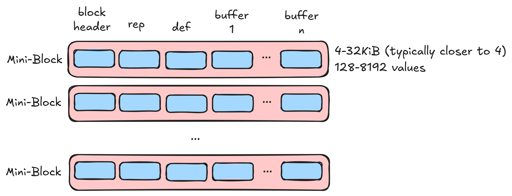
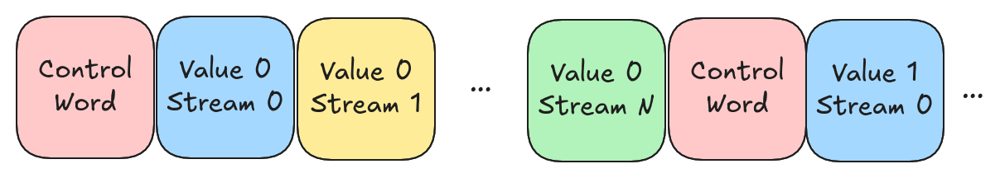
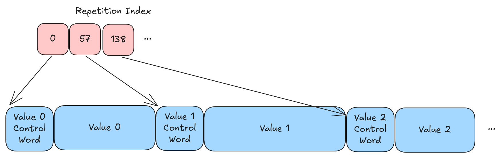
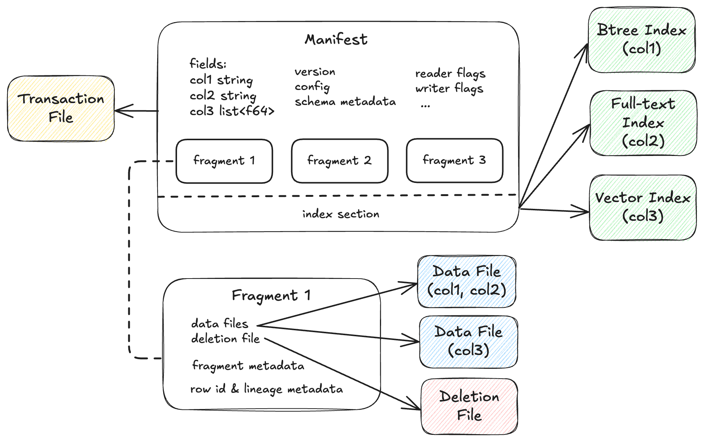
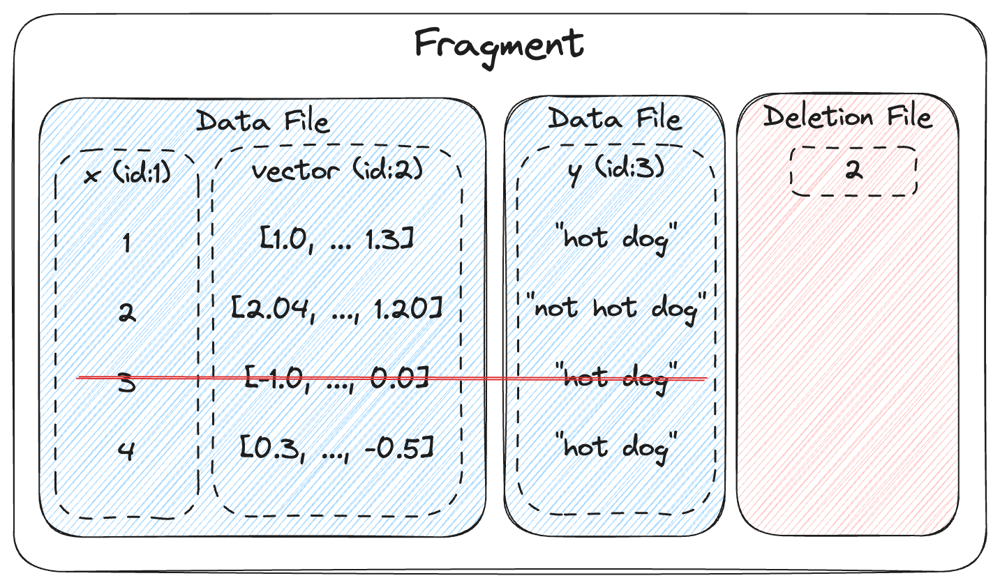
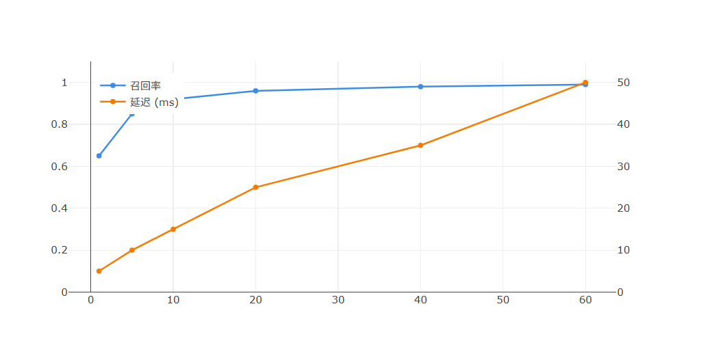
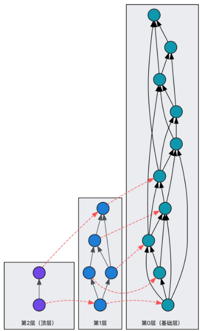

# LakeHouse


上面这是一个典型的湖仓架构，以及在每层架构中对应的技术栈，从低至上：

- Ojbect Store - 对象存储

  文件对象存储能力,典型的有S3,GCS等

- File Format - 文件格式

  定义一个简单文件以怎样的格式存储在磁盘当中

- Table Format - 表格式

  定义多个文件如何组成一个逻辑上的表

- Catalog Spec - 元数据规范

  定义系统怎么去发现和管理这些表的集合

- Catalog Service - 元数据服务

  定义一套或多套Catalog规范,提供统一元数据管理,数据治理等能力,这里面各个厂商有自己操作空间

- Compute Engines - 计算引擎

  执行数据工作流,包括查询,分析,向量检索,全文搜索等

# Lance-Format

Lance is an open lakehouse format for multimodal AI. It contains a **file format**, **table format**, and **catalog spec** that allows you to build a complete lakehouse on top of object storage to power your AI workflows. 

## Lance File Format

https://lance.org/format/file/


- Columns列数据都存在Pages(默认大小8MB)当中,不同的列由于其大小不一样,对应page数量也不一样,文件末尾的元数据定义了page的位置和数据编码方式.
- 对比Parquet格式,Lance Format没有"Row Group"的概念,只有Page.
- 每个Page都有一个绝对偏移量的引用,因此在Page之间可以插入非Page数据.
- 文件尾描述每个Page的元信息及其编码策略,这些元信息共同组成一系列"Column Descriptors"(其中说明每个列独立的Protobuf信息,即序列化信息).
- Offset Arrays描述了Column Descriptors和global buffer的偏移量.
- 固定大小的Footer描述了Offset Arrays的位置和元数据部分的开始.
- 所有列都会被"Column Index"引用,全局缓冲区也会被"Global Buffer Index"因此,且schema信息也是存在全局缓冲区中,其实就是external buffer的区域

实际读取数据是**从尾部元数据开始读**,解析Footer读取元数据,实际读取的时候也不是把所有列的数据都读上来,而是单个列的去读;实际读取数据是扫描某一列的页面,确定需要哪些页面,并且每个页面中都存储该页面中第一行的偏移量元数据,这样能快速确定需要的字节范围.


```text
// Note: the number of buffers (BN) is independent of the number of columns (CN)
//       and pages.
//
//       Buffers often need to be aligned.  64-byte alignment is common when
//       working with SIMD operations.  4096-byte alignment is common when
//       working with direct I/O.  In order to ensure these buffers are aligned
//       writers may need to insert padding before the buffers.
//
//       If direct I/O is required then most (but not all) fields described
//       below must be sector aligned.  We have marked these fields with an
//       asterisk for clarity.  Readers should assume there will be optional
//       padding inserted before these fields.
//
//       All footer fields are unsigned integers written with little endian
//       byte order.
//
// ├──────────────────────────────────┤
// | Data Pages                       |
// |   Data Buffer 0*                 |
// |   ...                            |
// |   Data Buffer BN*                |
// ├──────────────────────────────────┤
// | Column Metadatas                 |
// | |A| Column 0 Metadata*           |
// |     Column 1 Metadata*           |
// |     ...                          |
// |     Column CN Metadata*          |
// ├──────────────────────────────────┤
// | Column Metadata Offset Table     |
// | |B| Column 0 Metadata Position*  |
// |     Column 0 Metadata Size       |
// |     ...                          |
// |     Column CN Metadata Position  |
// |     Column CN Metadata Size      |
// ├──────────────────────────────────┤
// | Global Buffers Offset Table      |
// | |C| Global Buffer 0 Position*    |
// |     Global Buffer 0 Size         |
// |     ...                          |
// |     Global Buffer GN Position    |
// |     Global Buffer GN Size        |
// ├──────────────────────────────────┤
// | Footer                           |
// | A u64: Offset to column meta 0   |
// | B u64: Offset to CMO table       |
// | C u64: Offset to GBO table       |
// |   u32: Number of global bufs     |
// |   u32: Number of columns         |
// |   u16: Major version             |
// |   u16: Minor version             |
// |   "LANC"                         |
// ├──────────────────────────────────┤
//
// File Layout-End
```

Column Metadatas 

```text
message ColumnMetadata {

  // 描述page中列元信息
  message Page {
    // 页面缓冲区的文件偏移量
    repeated uint64 buffer_offsets = 1;
    // 页面缓冲区大小
    repeated uint64 buffer_sizes = 2;
    // 页面长度,例如有多少行
    uint64 length = 3;
    // 编码方式
    Encoding encoding = 4;
    // 页面优先级
    //
    // For tabular data this will be the top-level row number of the first row
    // in the page (and top-level rows should not split across pages).
    uint64 priority = 5;
  }
  // 列编码信息,描述如何去解析列元信息,例如描述统计数据或字典信息如何在列元数据中存储的
  Encoding encoding = 1;
  // 列的page数量
  repeated Page pages = 2;
  // 列元信息缓冲区的文件偏移量
  repeated uint64 buffer_offsets = 3;
  // 列元信息缓冲区大小
  repeated uint64 buffer_sizes = 4;

}
```

### Lance Encoding Strategy

编码策略决定数据如何编码写到磁盘页面上。Layout布局是一种将数组编码为一组缓冲区和子数组的方法。缓冲区是连续的字节序列。编码描述了数据的语义解释如何映射到布局。编码器将数据从一种布局转换为另一种布局。

结构化编码将数据分解成可以独立解码的单元，结构化编码由下面`PageLayout`描述，对应编码的几种方式：

```text
message PageLayout {
  oneof layout {
    // A layout used for pages where the data is small
    MiniBlockLayout mini_block_layout = 1;
    // A layout used for pages where all (visible) values are the same scalar value or null.
    ConstantLayout constant_layout = 2;
    // A layout used for pages where the data is large
    FullZipLayout full_zip_layout = 3;
    // A layout where large binary data is encoded externally
    // and only the descriptions are put in the page
    BlobLayout blob_layout = 4;
  }
}
```

**Lance 编码策略 = 结构编码（4 种布局自动选择）+ 压缩（多种算法按需组合）。**

### 结构化编码

#### Repetition and Definition Levels

Arrow作为一套内存数据结构标准，其数据存储在一个或多个连续的内存块中，通过**Validity Bitmap（NULL 标记位图）**、**Offsets Buffer（偏移数组）**和**Data Buffer（值缓冲区）**三部分来表示不同的数据类型。

| 数据类型                              | Buffer 0        | Buffer 1  | Buffer 2 | 额外 Buffers |
| ------------------------------------- | --------------- | --------- | -------- | ------------ |
| **Primitive**（int, float, bool）     | validity bitmap | data      | —        | —            |
| **Variable Binary**（String, Binary） | validity bitmap | offsets   | data     | —            |
| **Variable Binary View**              | validity bitmap | views     | —        | data buffers |
| **List**                              | validity bitmap | offsets   | —        | child array  |
| **List View**                         | validity bitmap | offsets   | sizes    | child array  |
| **Fixed-Size List**                   | validity bitmap | —         | —        | child array  |
| **Struct**                            | validity bitmap | —         | —        | child arrays |
| **Sparse Union**                      | type ids        | —         | —        | child arrays |
| **Dense Union**                       | type ids        | offsets   | —        | child arrays |
| **Dictionary-encoded**                | validity bitmap | indices   | —        | dictionary   |
| **Run-End Encoded**                   | —               | run\_ends | values   | —            |

> [!IMPORTANT]
>
> **有Arrow格式为什么不直接落盘，而是通过R&D Levels机制对数据进行编码再落盘？**
>
> 相比较于Arrow格式，R&D Levels的优势在于它将这三个buffers组合成单个buffer，避免多次IOPS

|               | Arrow 标准格式        | Lance R\&D Levels                 |
| ------------- | --------------------- | --------------------------------- |
| **NULL 表达** | 多层 validity bitmaps | 单个 Definition Level 数组        |
| **List 边界** | 多层 offset 数组      | 单个 Repetition Level 数组        |
| **内存布局**  | 多个独立 buffer       | **单一紧凑 buffer**               |
| **I/O 效率**  | 多次随机读取          | **顺序扫描，单次 I/O**            |
| **编码方向**  | —                     | 0 = inner-most（与 Parquet 相反） |

对于列式存储（如 Lance、Parquet），扫描大数据时：

- **Arrow 方式**：需要分别读取 validity bitmap、offset array、data array，产生多次随机 I/O
- **R&D Levels 方式**：一个紧凑的整数数组顺序存储，配合 values 数组，**两次顺序读取**即可解码全部结构信息

这在**磁盘存储**和**网络传输**场景下能显著提升性能。

##### Definition Levels

```text
[{"middle": {"inner": 1]}}, NULL, {"middle": NULL}, {"middle": {"inner": NULL}}]
```

Arrow结构下针对每层结构，validity bitmap来表示是否为NULL

```text
Outer validity : 1, 0, 1, 1  # 最外层[]总共四个元素，NULL标0，非NULL标1
Middle validity: 1, ?, 0, 1  # 中间层{}，middle元素为NULL标0，middle元素不为NULL标1，middle元素不存在标？
Inner validity : 1, ?, ?, 0  # 最内层{}，inner元素为NULL标0，inner元素不为NULL标1，inner元素不存在标？
Values         : 1, ?, ?, ?  # 对应值，不存在标？，NULL标0
```

使用Definition Levels表示

| 值   | 层级 | 解释                                                         |
| ---- | ---- | ------------------------------------------------------------ |
| 1    | 0    | 当前值1在最内层（lance用0表示最内层，parquet用0表示最外层）  |
| ？   | 3    | 当前值在[,NULL,,]元素位置，从最内存0开始数所在层级是3        |
| ？   | 2    | 当前值在[,,{"middle": NULL},]元素位置，所在层级middle就是2   |
| ？   | 1    | 当前值在[,,,{"middle": {"inner": NULL}}]元素位置，所在层级inner是1 |

核心：**当前值定义到哪一层**

##### Repetition Levels

```text
[{<0,1>, <>, <2>}, {<3>}, {}], [], [{<4>}]
```

Arrow结构下针对每层结构，对应就会有三个offset arrays

```text
Outer-most ([]): [0, 3, 3, 4]  # 都从0开始第1个[]有3个元素（0-3表示第1个[]），第2个[]有0个元素（3-3表示第2个[]），第三个[]有1个元素（3-4表示第3个[]）
Middle     ({}): [0, 3, 4, 4, 5]  # 第1个{}有3个元素（0-3表示第1个{}），第2个{}有1个元素（3-4表示第2个{}），第3个{}有0个元素（4-4表示第3个{}），第4个{}有1个元素（4-5表示第4个{}）
Inner      (<>): [0, 2, 2, 3, 4, 5]  # 第1个<>有2个元素（0-2表示第1个<>），第2个<>有0个元素（2-2表示第2个<>），第3个<>有1个元素（2-3表示第3个<>），第4个<>有1个元素（3-4表示第4个<>），第5个<>有1个元素（4-5表示第5个<>）
Values         : [0, 1, 2, 3, 4]  # 最终值
```

使用Repetition Levels表示

| 值   | Repetition | 为什么？                                              |
| ---- | ---------- | ----------------------------------------------------- |
| 0    | 3          | 一切从头开始：`[[{<` — 最外层新列表                   |
| 1    | 0          | `0, 1` 在同一个 `< >` 里，继续最内层                  |
| ?    | 1          | `<>` 是空列表，但它表示"内层新列表开始"（虽然没有值） |
| 2    | 1          | `<2>` 是新的内层列表（但还在同一个 `{ }` 里）         |
| 3    | 2          | `{<3>}` 是新的中层列表（外层 `[ ]` 继续）             |
| ?    | 2          | `{}` 空中层列表，"中层新列表开始"                     |
| ?    | 3          | `[]` 空外层列表，"外层新列表开始"                     |
| 4    | 0          | 没有同列表的值需要延续，用0表示最内层                 |

核心：**当前值所在的列表，与上一个值共享到哪一层**

##### 结合D&R Levels例子还原数据结构

原数据结构

```text
[{<0,1>, <>, <2>}, {<3>}, {}], [], [{}]
```

Repetition Levels

```text
Rep:    [3, 0, 1, 1, 2, 2, 3, 3]
         ↑  ↑  ↑  ↑  ↑  ↑  ↑  ↑
         0  1  空 2  3  空 空 空
```

Definition Levels

```text
Def:    [0, 0, 1, 0, 0, 2, 3, 2]
         ↑  ↑  ↑  ↑  ↑  ↑  ↑  ↑
         0  1  空 2  3  空 空 空
```

扫描 (Rep, Def) 对重建：

| (Rep, Def) | 含义                                 |
| ---------- | ------------------------------------ |
| (3, 0)     | 新外层 → 新中层 → 新内层 → 值 `0`    |
| (0, 0)     | 继续内层 → 值 `1`                    |
| (1, 1)     | 新内层，但 def=1 表示内层空          |
| (1, 0)     | 新内层 → 值 `2`                      |
| (2, 0)     | 新中层 → 新内层 → 值 `3`             |
| (2, 2)     | 新中层，但 def=2 表示中层空          |
| (3, 3)     | 新外层，def=3 表示外层空             |
| (3, 2)     | 新外层 → 新中层，但 def=2 表示中层空 |

 (Rep, Def) 对就定义了一个完整结构，有值的对一定是def为0，即最内层

#### Mini Block Page Layout

专门用于**小数据类型**（如整数、浮点、短字符串、布尔值等）的一种**自适应结构编码策略**。

将数据切分为多个小数据块（4KB~8KB），每个块自包含、可独立解码，在扫描性能与随机访问之间做权衡。

| 属性       | 规格                                        |
| ---------- | ------------------------------------------- |
| **块大小** | 压缩后 **4~32KB**（通常接近 4KB）           |
| **值数量** | 2 的幂次方（128~8192 个值），最后一个块例外 |
| **对齐**   | 按 **8 字节边界** 填充                      |
| **块头**   | 每个块开头有小 header，记录填充量           |



两个层级：Page vs Mini Block

| 层级                     | 范围              | Buffer 数量                                                  |
| ------------------------ | ----------------- | ------------------------------------------------------------ |
| **Page（页面）**         | 整个列的一页数据  | **3~4 个 Buffer**（Buffer 0/1/2/3）                          |
| **Mini Block（迷你块）** | Page 内的一个小块 | **内部有多个部分**（header + rep + def + values），但这些**不是独立的 Page Buffer** |

Page 级别的 Buffer（3~4 个）

```text
┌─────────────────────────────────────────────────────────────┐
│                         Page                                │
├─────────────────────────────────────────────────────────────┤
│  Buffer 0: Mini Block 元数据（每个块 2 字节）                   │
├─────────────────────────────────────────────────────────────┤
│  Buffer 1: 所有 Mini Blocks 的压缩数据顺序排列                  │
│            ┌─────────┬─────────┬─────────┐                  │
│            │ Block 0 │ Block 1 │ Block N │                  │
│            │(4~8KB)  │(4~8KB)  │(剩余)   │                  │
│            └─────────┴─────────┴─────────┘                  │
├─────────────────────────────────────────────────────────────┤
│  Buffer 2（可选）: 字典 或 Repetition Index                   │
├─────────────────────────────────────────────────────────────┤
│  Buffer 3（可选）: Repetition Index（如果 Buffer 2 是字典）     │
└─────────────────────────────────────────────────────────────┘
```

一个Mini-Block的块内布局：

```text
┌──────────┬─────────┬─────────┬─────────┬─────┬─────────┐
│  block   │   rep   │   def   │ buffer  │ ... │ buffer  │
│  header  │ levels  │ levels  │    1    │     │    n    │
└──────────┴─────────┴─────────┴─────────┴─────┴─────────┘
```

这些是 **Mini Block 内部的逻辑分区**，不是 Page 级别的独立 Buffer。它们被压缩后**连续存储在 Buffer 1 中**。

- 各 buffer **分开顺序存储**（repetition → definition → values），**不交错/不 zip**
- 因为读整个块才能读单个值，所以无需 zip 各 buffer
- 压缩算法**不透明**（可用任意算法：LZ4、Zstd、Bitpacking、RLE 等）

|              | Page Buffer                      | Mini Block 内部                                |
| ------------ | -------------------------------- | ---------------------------------------------- |
| **物理位置** | 页面级别的独立存储区域           | 嵌在 Buffer 1 内部                             |
| **数量**     | 固定 2~4 个                      | 变长（header + rep + def + n 个 value buffer） |
| **作用**     | 页面级的元数据/数据/索引         | 块级的数据组织                                 |
| **读取粒度** | 按需读取（如只读 Buffer 0 定位） | 必须**整个块一起读**                           |

> [!IMPORTANT]
>
> **一句话理解：**一个 Page 有 2~4 个 Buffer（0/1/2/3）。一个 Mini Block 本身不是独立 Buffer，而是 Buffer 1 内部的一个压缩数据单元，内部包含 header + rep + def + value buffers 等逻辑分区。

```text
┌─────────────────────────────────────────────────────────────┐
│                        Lance Page                            │
├─────────────────────────────────────────────────────────────┤
│  Buffer 0: Mini Block 元数据                                  │
│  ┌────────┬────────┬────────┬────────┐                      │
│  │ 2字节   │ 2字节   │ 2字节   │ ...    │  ← 每块一个条目      │
│  │(块#0)  │(块#1)  │(块#2)  │        │                      │
│  └────────┴────────┴────────┴────────┘                      │
├─────────────────────────────────────────────────────────────┤
│  Buffer 1: Mini Blocks 数据                                   │
│  ┌─────────────────────────────────────────────────────┐    │
│  │  MiniBlock 0  │  MiniBlock 1  │  MiniBlock 2  │ ... │    │
│  │  ┌─────┬────┬────┬────────┐  │  ...          │     │    │
│  │  │header│rep │def │values..│  │               │     │    │
│  │  └─────┴────┴────┴────────┘  │               │     │    │
│  └─────────────────────────────────────────────────────┘    │
├─────────────────────────────────────────────────────────────┤
│  Buffer 2（可选）:                                             │
│    ├── 字典编码时: 字典值                                      │
│    ├── 有 List 时: Repetition Index                           │
│    └── 两者都有时: Buffer 2=字典, Buffer 3=Repetition Index   │
└─────────────────────────────────────────────────────────────┘
```

> Buffer 0：Mini Block 元数据

| 属性         | 说明                                            |
| ------------ | ----------------------------------------------- |
| **作用**     | 支持**随机访问**的快速查找表                    |
| **内容**     | 每个 Mini Block 2 字节的元数据                  |
| **格式**     | 低 4 bits = `log₂(值数量)`，高 12 bits = 字节数 |
| **加载时机** | **初始化阶段**必须加载到 Search Cache           |
| **内存占用** | 极少（10亿行约 1.28 GiB）                       |

```text
每个块 2 字节示例：
┌─────────────────────────────────────┐
│  0x0A      │      0x0247            │
│  低4bits   │      高12bits           │
│  log₂(1024)=10 │   679 words=5432 bytes │
└─────────────────────────────────────┘
```

**为什么需要它？** 随机访问时，先查 Buffer 0 定位到具体的 Mini Block，然后只读那个块。

> Buffer 1：Mini Blocks 数据（实际数据）

| 属性           | 说明                                                         |
| -------------- | ------------------------------------------------------------ |
| **作用**       | 存储**所有压缩后的 Mini Block**                              |
| **内容**       | 多个 Mini Block 顺序排列                                     |
| **每个块内部** | `block header` + `rep levels` + `def levels` + `buffer 1...n` + `padding` |
| **块大小**     | 压缩后 4~32KB（通常接近 4KB）                                |
| **值数量**     | 128~8192 个值（2 的幂，最后一个块例外）                      |

```text
Buffer 1 的物理布局：
┌─────────────┬─────────────┬─────────────┐
│  MiniBlock  │  MiniBlock  │  MiniBlock  │
│     #0      │     #1      │     #N      │
│  (4~8KB)    │  (4~8KB)    │  (剩余)      │
└─────────────┴─────────────┴─────────────┘
```

逻辑上的主数据，物理上实际是buffer1

> Buffer 2：字典或重复索引（可选）

Buffer 2 是**复用**的，根据数据特征二选一：

情况 A：Dictionary Encoding（字典编码）

| 属性         | 说明                                      |
| ------------ | ----------------------------------------- |
| **内容**     | 字典值（唯一值的集合）                    |
| **加载时机** | 初始化时**全部加载并解码**到 Search Cache |
| **压缩**     | 通过 block-compression 路径单独配置       |
| **适用**     | 低基数列（如状态码、类别）                |

```text
有字典时的页面布局：
Buffer 0: 元数据
Buffer 1: Mini Blocks（存的是字典索引，不是原始值）
Buffer 2: 字典值
```

情况 B：Repetition Index（重复索引）

| 属性         | 说明                                                    |
| ------------ | ------------------------------------------------------- |
| **内容**     | u64 数组，N × D 个值（N=块数，D=随机访问深度+1）        |
| **作用**     | 将**行偏移**翻译为**item 偏移**（支持 List 的随机访问） |
| **当前限制** | 仅支持 **1 维随机访问**                                 |
| **压缩**     | **目前不压缩**                                          |

```text
无字典、有 List 时的页面布局：
Buffer 0: 元数据
Buffer 1: Mini Blocks
Buffer 2: Repetition Index
```

> 情况 C：两者都有

| 属性         | 说明             |
| ------------ | ---------------- |
| **Buffer 2** | 字典             |
| **Buffer 3** | Repetition Index |

> 读取流程示例

全表扫描（Full Scan）

```text
1. 顺序读取 Buffer 1 的所有 Mini Blocks
2. 逐个解码（rep → def → values）
3. 无需 Buffer 0 和 Buffer 2
```

随机点查（Random Access）

```text
1. 从 Buffer 0 查目标行属于哪个 Mini Block
   （通过累加各块值数量定位）
2. 读取对应的 Mini Block（Buffer 1 中的某个范围）
3. 如果有 List，用 Buffer 2 的 Repetition Index 翻译偏移
4. 解码该块，找到目标值
```

#### Full Zip Page Layout

> 使用场景

- 大数据类型（≥128 字节/值，如向量嵌入）
- 避免 Mini Block 的"每 16 个值一个描述符"的元数据开销

> 核心特点

| 特性             | 说明                                                         |
| ---------------- | ------------------------------------------------------------ |
| **透明压缩**     | 压缩后必须返回固定宽度或可变宽度的 flat layout，以便索引单个值 |
| **Zip 存储**     | repetition、definition、value 数据**交错 zip 到单个 buffer** |
| **Control Word** | 每个值开头有控制字，包含 rep/def 信息和值大小                |

> Data Buffer（buffer0）



| Bytes | Meaning        |
| :---- | :------------- |
| 0-4   | Control word 0 |
| 0/4/8 | Value 0 size   |
| *     | Value 0 data   |
| ...   | ...            |
| 0-4   | Control word N |
| 0/4/8 | Value N size   |
| *     | Value N data   |

> Repetition Index (Buffer 1)



> 读取流程示例

- 随机访问需要 **2 次 I/O**：先读 repetition index 定位，再读 data buffer
- 也可将整个 repetition index 加载到内存缓存中

> protobuf

```text
message FullZipLayout {
  // The number of bits of repetition info (0 if there is no repetition)
  uint32 bits_rep = 1;
  // The number of bits of definition info (0 if there is no definition)
  uint32 bits_def = 2;
  // The number of bits of value info
  //
  // Note: we use bits here (and not bytes) for consistency with other encodings.  However, in practice,
  // there is never a reason to use a bits per value that is not a multiple of 8.  The complexity is not
  // worth the small savings in space since this encoding is typically used with large values already.
  oneof details {
    // If this is a fixed width block then we need to have a fixed number of bits per value
    uint32 bits_per_value = 3;
    // If this is a variable width block then we need to have a fixed number of bits per offset
    uint32 bits_per_offset = 4;
  }
  // The number of items in the page
  uint32 num_items = 5;
  // The number of visible items in the page
  uint32 num_visible_items = 6;
  // Description of the compression of values
  CompressiveEncoding value_compression = 7;
  // The meaning of each repdef layer, used to interpret repdef buffers correctly
  repeated RepDefLayer layers = 8;

}
```

描述数据缓存区压缩、控制字大小、每个值有多少位

#### Constant Page Layout

- **适用**：所有可见值都是相同的标量值，或全为 NULL
- **存储**：只需 rep/def levels + 内联标量值（≤32 字节）
- 即使全 NULL，如果有 Struct/List 层级，仍需存储 rep/def levels 以区分"空结构" vs "空列表" vs "NULL 值"

> protobuf

```text
message ConstantLayout {
  // The meaning of each repdef layer, used to interpret repdef buffers correctly
  repeated RepDefLayer layers = 5;

  // Inline fixed-width scalar value bytes.
  //
  // This MUST only be used for types where a single non-null element is represented by a single
  // fixed-width Arrow value buffer (i.e. no offsets buffer, no child data).
  //
  // Constraints:
  // - MUST be absent for an all-null page
  // - MUST be <= 32 bytes if present
  optional bytes inline_value = 6;

  // Optional compression algorithm used for the repetition buffer.
  // If absent, repetition levels are stored as raw u16 values.
  CompressiveEncoding rep_compression = 7;
  // Optional compression algorithm used for the definition buffer.
  // If absent, definition levels are stored as raw u16 values.
  CompressiveEncoding def_compression = 8;
  // Number of values in repetition buffer after decompression.
  uint64 num_rep_values = 9;
  // Number of values in definition buffer after decompression.
  uint64 num_def_values = 10;

}
```

只需要知道R&D Levels和（如果存在）内联标量值字节即可。

#### Blob Page Layout

- **适用**：超大二进制数据（如 1MB+ 的图片、视频）
- **设计**：数据存储在外部 buffer，页面只存**描述符**（position + size）
- **NULL 编码**：position 和 size 都为 0 → 空值；size=0 且 position≠0 → NULL（position 存 definition level）
- **I/O 模型**：每个值一次 I/O，适合 justify 单 IOPS 的场景

> protobuf

```text
message BlobLayout {
  // The inner layout used to store the descriptions
  PageLayout inner_layout = 1;
  // The meaning of each repdef layer, used to interpret repdef buffers correctly
  //
  // The inner layout's repdef layers will always be 1 all valid item layer
  repeated RepDefLayer layers = 2;

}
```

### 半结构化数据转换

在进行结构化编码前要对数据进行转转换，具体转换手段如下：

| 转换                    | 说明                                                         |
| ----------------------- | ------------------------------------------------------------ |
| **Dictionary Encoding** | 字典编码，适用于低基数列，在结构编码前应用                   |
| **Struct Packing**      | 将 Struct 从列式转为行式存储，减少随机访问 I/O，但不能再单独读字段 |
| **Fixed Size List**     | 扁平化固定大小列表，压缩库无需关心 list 结构                 |

### 数据压缩

| 技术                   | 适用场景       | 特点                                                 |
| ---------------------- | -------------- | ---------------------------------------------------- |
| **Flat**               | 固定宽度数据   | 无压缩，找最大 2 的幂值数使块 < 8KB                  |
| **Variable**           | 可变宽度数据   | 无压缩，walk 值直到接近 4KB                          |
| **Bitpacking**         | 整数数据       | 去除未使用的高位，每块 1024 值                       |
| **RLE**                | 重复值多的数据 | 游程编码，阈值默认 0.5（run\_count / num\_values）   |
| **FSST**               | 字符串数据     | 快速静态符号表压缩                                   |
| **BSS**                | 浮点数据       | 字节流拆分，配合通用压缩使用                         |
| **General (LZ4/Zstd)** | 所有数据       | 通用压缩，Mini Block 中压整个块，Full Zip 中压每个值 |

### Lance配置参数

| 配置项                             | 说明                                |
| ---------------------------------- | ----------------------------------- |
| `lance-encoding:compression`       | `lz4` / `zstd` / `none` / `fsst`    |
| `lance-encoding:compression-level` | 压缩级别（Zstd: 0-22）              |
| `lance-encoding:rle-threshold`     | RLE 阈值（默认 0.5）                |
| `lance-encoding:bss`               | `off` / `on` / `auto`               |
| `lance-encoding:dict-divisor`      | 字典编码触发阈值                    |
| `LANCE_MINIBLOCK_MAX_VALUES`       | mini-block每块最大值数（默认 4096） |

## Lance Table Format

The Lance table format organizes datasets as **versioned collections of fragments and indices**. Each version is described by an **immutable manifest file** that references **data files, deletion files, transaction file and indices**. The format supports **ACID transactions, schema evolution, and efficient incremental updates through Multi-Version Concurrency Control (MVCC).**



**Fragment**

一个片段（fragment）表示数据集的水平分区，包含一组行数据。每个片段都有一个唯一的uint32标识符，该标识符根据数据集的最大片段ID递增分配。每个fragment包含一个或多个数据列存储文件，即.lance文件（每个文件都可以单独压缩/编码），另外还可能包含至多一个可选的删除文件。



DataFragment序列化信息

```rust
message DataFragment {
  // The ID of a DataFragment is unique within a dataset.
  uint64 id = 1;

  repeated DataFile files = 2;

  // File that indicates which rows, if any, should be considered deleted.
  DeletionFile deletion_file = 3;

  // TODO: What's the simplest way we can allow an inline tombstone bitmap?

  // A serialized RowIdSequence message (see rowids.proto).
  //
  // These are the row ids for the fragment, in order of the rows as they appear.
  // That is, if a fragment has 3 rows, and the row ids are [1, 42, 3], then the
  // first row is row 1, the second row is row 42, and the third row is row 3.
  oneof row_id_sequence {
    // If small (< 200KB), the row ids are stored inline.
    bytes inline_row_ids = 5;
    // Otherwise, stored as part of a file.
    ExternalFile external_row_ids = 6;
  } // row_id_sequence

  oneof last_updated_at_version_sequence {
    // If small (< 200KB), the row latest updated versions are stored inline.
    bytes inline_last_updated_at_versions = 7;
    // Otherwise, stored as part of a file.
    ExternalFile external_last_updated_at_versions = 8;
  } // last_updated_at_version_sequence

  oneof created_at_version_sequence {
    // If small (< 200KB), the row created at versions are stored inline.
    bytes inline_created_at_versions = 9;
    // Otherwise, stored as part of a file.
    ExternalFile external_created_at_versions = 10;
  } // created_at_version_sequence

  // Number of original rows in the fragment, this includes rows that are now marked with
  // deletion tombstones. To compute the current number of rows, subtract
  // `deletion_file.num_deleted_rows` from this value.
  uint64 physical_rows = 4;

}
```

- data files: 用于存储一个fragment中列的子集

  ```rust
  message DataFile {
    // Path to the root relative to the dataset's URI.
    string path = 1;
    // The ids of the fields/columns in this file.
    //
    // When a DataFile object is created in memory, every value in fields is assigned -1 by
    // default. An object with a value in fields of -1 must not be stored to disk. -2 is
    // used for "tombstoned", meaning a field that is no longer in use. This is often
    // because the original field id was reassigned to a different data file.
    //
    // In Lance v1 IDs are assigned based on position in the file, offset by the max
    // existing field id in the table (if any already). So when a fragment is first created
    // with one file of N columns, the field ids will be 1, 2, ..., N. If a second fragment
    // is created with M columns, the field ids will be N+1, N+2, ..., N+M.
    //
    // In Lance v1 there is one field for each field in the input schema, this includes
    // nested fields (both struct and list).  Fixed size list fields have only a single
    // field id (these are not considered nested fields in Lance v1).
    //
    // This allows column indices to be calculated from field IDs and the input schema.
    //
    // In Lance v2 the field IDs generally follow the same pattern but there is no
    // way to calculate the column index from the field ID.  This is because a given
    // field could be encoded in many different ways, some of which occupy a different
    // number of columns.  For example, a struct field could be encoded into N + 1 columns
    // or it could be encoded into a single packed column.  To determine column indices
    // the column_indices property should be used instead.
    //
    // In Lance v1 these ids must be sorted but might not always be contiguous.
    repeated int32 fields = 2;
    // The top-level column indices for each field in the file.
    //
    // If the data file is version 1 then this property will be empty
    //
    // Otherwise there must be one entry for each field in `fields`.
    //
    // Some fields may not correspond to a top-level column in the file.  In these cases
    // the index will -1.
    //
    // For example, consider the schema:
    //
    // - dimension: packed-struct (0):
    //   - x: u32 (1)
    //   - y: u32 (2)
    // - path: `list<u32>` (3)
    // - embedding: `fsl<768>` (4)
    //   - fp64
    // - borders: `fsl<4>` (5)
    //   - simple-struct (6)
    //     - margin: fp64 (7)
    //     - padding: fp64 (8)
    //
    // One possible column indices array could be:
    // [0, -1, -1, 1, 3, 4, 5, 6, 7]
    //
    // This reflects quite a few phenomenon:
    // - The packed struct is encoded into a single column and there is no top-level column
    //   for the x or y fields
    // - The variable sized list is encoded into two columns
    // - The embedding is encoded into a single column (common for FSL of primitive) and there
    //   is not "FSL column"
    // - The borders field actually does have an "FSL column"
    //
    // The column indices table may not have duplicates (other than -1)
    repeated int32 column_indices = 3;
    // The major file version used to create the file
    uint32 file_major_version = 4;
    // The minor file version used to create the file
    //
    // If both `file_major_version` and `file_minor_version` are set to 0,
    // then this is a version 0.1 or version 0.2 file.
    uint32 file_minor_version = 5;
  
    // The known size of the file on disk in bytes.
    //
    // This is used to quickly find the footer of the file.
    //
    // When this is zero, it should be interpreted as "unknown".
    uint64 file_size_bytes = 6;
  
    // The base path index of the data file. Used when the file is imported or referred from another dataset.
    // Lance use it as key of the base_paths field in Manifest to determine the actual base path of the data file.
    optional uint32 base_id = 7;
  
  }
  ```

- delete file: 一个fragment中至多有一个删除文件，该删除文件用于跟踪已删除的行，而无需重写数据文件。其中包含两种存储格式：Arrow IPC格式（扩展名为.arrow）存储一个Int32Array，其中包含被删除行的偏移量，适用于稀疏删除场景；Roaring Bitmap格式（扩展名为.bin）存储一个压缩的Roaring Bitmap，适用于密集删除场景。实际在读取数据的时候需要过滤掉该删除文件中出现的偏移量所对应的行。

  ```rust
  message DeletionFile {
    // Type of deletion file, intended as a way to increase efficiency of the storage of deleted row
    // offsets. If there are sparsely deleted rows, then ARROW_ARRAY is the most efficient. If there
    // are densely deleted rows, then BITMAP is the most efficient.
    enum DeletionFileType {
      // A single Int32Array of deleted row offsets, stored as an Arrow IPC file with one batch and
      // one column. Has a .arrow extension.
      ARROW_ARRAY = 0;
      // A Roaring Bitmap of deleted row offsets. Has a .bin extension.
      BITMAP = 1;
    }
  
    // Type of deletion file.
    DeletionFileType file_type = 1;
    // The version of the dataset this deletion file was built from.
    uint64 read_version = 2;
    // An opaque id used to differentiate this file from others written by concurrent
    // writers.
    uint64 id = 3;
    // The number of rows that are marked as deleted.
    uint64 num_deleted_rows = 4;
    // The base path index of the deletion file. Used when the file is imported or referred from another
    // dataset. Lance uses it as key of the base_paths field in Manifest to determine the actual base
    // path of the deletion file.
    optional uint32 base_id = 7;
  
  }
  ```

### schema

schema序列化信息

```rust
message Field {
  enum Type {
    PARENT = 0;
    REPEATED = 1;
    LEAF = 2;
  }
  Type type = 1;

  // Fully qualified name.
  string name = 2;
  /// Field Id.
  ///
  /// See the comment in `DataFile.fields` for how field ids are assigned.
  int32 id = 3;
  /// Parent Field ID. If not set, this is a top-level column.
  int32 parent_id = 4;

  // Logical types, support parameterized Arrow Type.
  //
  // PARENT types will always have logical type "struct".
  //
  // REPEATED types may have logical types:
  // * "list"
  // * "large_list"
  // * "list.struct"
  // * "large_list.struct"
  // The final two are used if the list values are structs, and therefore the
  // field is both implicitly REPEATED and PARENT.
  //
  // LEAF types may have logical types:
  // * "null"
  // * "bool"
  // * "int8" / "uint8"
  // * "int16" / "uint16"
  // * "int32" / "uint32"
  // * "int64" / "uint64"
  // * "halffloat" / "float" / "double"
  // * "string" / "large_string"
  // * "binary" / "large_binary"
  // * "date32:day"
  // * "date64:ms"
  // * "decimal:128:{precision}:{scale}" / "decimal:256:{precision}:{scale}"
  // * "time:{unit}" / "timestamp:{unit}" / "duration:{unit}", where unit is
  // "s", "ms", "us", "ns"
  // * "dict:{value_type}:{index_type}:false"
  string logical_type = 5;
  // If this field is nullable.
  bool nullable = 6;

  // optional field metadata (e.g. extension type name/parameters)
  map<string, bytes> metadata = 10;  

  bool unenforced_primary_key = 12;

  // Position of this field in the primary key (1-based).
  // 0 means the field is part of the primary key but uses schema field id for ordering.
  // When set to a positive value, primary key fields are ordered by this position.
  uint32 unenforced_primary_key_position = 13;

  // DEPRECATED ----------------------------------------------------------------

  // Deprecated: Only used in V1 file format. V2 uses variable encodings defined
  // per page.
  //
  // The global encoding to use for this field.
  Encoding encoding = 7;

  // Deprecated: Only used in V1 file format. V2 dynamically chooses when to
  // do dictionary encoding and keeps the dictionary in the data files.
  //
  // The file offset for storing the dictionary value.
  // It is only valid if encoding is DICTIONARY.
  //
  // The logic type presents the value type of the column, i.e., string value.
  Dictionary dictionary = 8;

  // Deprecated: optional extension type name, use metadata field
  // ARROW:extension:name
  string extension_name = 9;

  // Field number 11 was previously `string storage_class`.
  // Keep it reserved so older manifests remain compatible while new writers
  // avoid reusing the slot.
  reserved 11;
  reserved "storage_class";

}
```

### transaction

Lance 采用 **MVCC（多版本并发控制）** 提供 ACID 事务保证。每次提交都会通过原子存储操作创建一个**新的、不可变的表版本**，所有版本构成可序列化的历史，支持**时间旅行（time travel）**和**模式演进（schema evolution）**。

事务是 Lance 中变更的基本单位，支持**乐观并发控制**和**自动冲突解决**。

#### 提交协议

**存储原语**

Lance 依赖底层对象存储的两个原子操作：

- **rename-if-not-exists**：仅在目标不存在时原子重命名文件
- **put-if-not-exists**（条件 PUT）：仅在文件不存在时原子写入

这两个原语保证多个写入者并发创建同一个 manifest 文件时，**有且仅有一个成功**。

**Manifest 命名方案**

- **V1**：`{version}.manifest`（单调递增版本号，如 `1.manifest`）
- **V2**：`{u64::MAX - version:020}.manifest`（反向字典序，便于快速发现最新版本）

**事务文件（Transaction Files）**

存储每次提交尝试的序列化事务 protobuf 消息，用于：

1. 提交重试时重建 manifest（当并发事务已提交时）
2. 通过描述执行的操作来支持冲突检测

**提交算法**

尝试使用存储原语原子写入新的 manifest 文件。当并发写入者冲突时，系统加载事务文件检测冲突，并尝试**重基（rebase）**事务。如果原子提交失败，则使用更新后的事务状态重试。

#### 事务类型

每个事务包含 `read_version`（基于哪个版本构建）、`uuid`（唯一标识）和 `operation`（操作类型）。

主要事务类型：

| 类型                  | 说明                                                         | 关键特性                                               |
| --------------------- | ------------------------------------------------------------ | ------------------------------------------------------ |
| **Append**            | 追加新数据片段（fragment），不修改现有数据                   | 与大多数操作兼容，支持并发追加                         |
| **Delete**            | 使用删除向量（deletion vectors）标记行删除                   | 可更新片段或删除整个片段；支持重基合并删除向量         |
| **Overwrite**         | 完全覆盖表（新数据、新模式、新配置）                         | 几乎与所有其他操作冲突，但配置冲突可重试               |
| **CreateIndex**       | 添加/替换/删除二级索引（向量、标量、全文索引）               | 新片段可暂时无索引；更新/删除与建索引兼容              |
| **Rewrite**           | 重组数据（压缩、去碎片化、重排序），不改变语义               | 改变行地址，需预留 fragment ID；与索引操作有条件兼容   |
| **Merge**             | 添加新列，修改模式                                           | **过于通用的操作**，冲突概率高，建议优先用更具体的操作 |
| **Project**           | 删除列（仅元数据操作，不修改数据文件）                       | 与大多数操作兼容                                       |
| **Restore**           | 回滚到历史版本                                               | 优先级最高，与几乎所有操作冲突                         |
| **ReserveFragments**  | 预分配 fragment ID，供后续 Rewrite 使用                      | 仅与修改 max fragment id 的操作冲突                    |
| **Clone**             | 浅拷贝（仅元数据）或深拷贝（完整复制）                       | 只能是数据集的第一个操作                               |
| **Update**            | 修改行值（不增删行），支持 REWRITE\_ROWS 和 REWRITE\_COLUMNS 两种模式 | 兼具删除和追加特性；可重基合并删除掩码                 |
| **UpdateConfig**      | 修改表配置、元数据                                           | 仅与修改相同配置键的操作冲突                           |
| **DataReplacement**   | 替换特定列区域的数据                                         | 比 Merge/Update 更安全简单                             |
| **UpdateMemWalState** | 更新 MemWal 索引状态                                         | -                                                      |
| **UpdateBases**       | 添加新的 base path，引用其他位置的数据文件                   | 仅与相同 id/name/path 的 UpdateBases 冲突              |

#### 冲突解决

三种冲突结果：

1. **可重基（Rebasable）**：事务可被自动修改以融入并发变更，然后在提交层自动重试
2. **可重试（Retryable）**：无法自动重基，但可在应用层重新执行（需重新读取数据并重试）
3. **不兼容（Incompatible）**：根本冲突，重试会产生语义不同的结果，返回不可重试错误

##### 重基机制（Rebase Mechanism）

`TransactionRebase` 结构跟踪：

- 片段映射（标记哪些需要重写）
- 修改检测（跟踪被修改或删除的 fragment ID）
- 受影响行（Delete/Update 操作中的具体行，用于细粒度冲突检测）
- Fragment 重用索引（累积并发 Rewrite 的元数据）

重基过程会比较片段修改、检测行重叠、合并删除向量、更新索引引用等。

##### 冲突场景示例

**可重基冲突示例**：

- Writer A 删除片段中的行 100-199，提交成功
- Writer B 删除同一片段中的行 500-599
- 两者修改的行不重叠，Writer B 可自动重基：合并删除向量后成功提交

**可重试冲突示例**：

- Writer A 压缩片段 1-5
- Writer B 更新片段 3 中的行
- 片段 3 已不存在（被压缩），无法自动重基，需应用层重新执行更新

**不兼容冲突示例**：

- Writer A 将表恢复到版本 1
- Writer B 尝试删除版本 2-3 中添加的行
- 表已恢复到 v1，目标行已不存在，重试会产生不同语义，返回不兼容错误

### Layout（存储物理布局）

Lance 的存储布局设计强调**可移植性**，允许数据集在不同对象存储系统之间迁移或引用，且只需修改最少的元数据。

#### 数据集根目录（Dataset Root）

每个 Lance 数据集有且仅有一个**数据集根目录**，这是数据集创建时的初始位置，也是文件的主要存储位置。根目录包含标准的子目录结构：

- `data/` — 数据文件
- `_versions/` — Manifest 文件（版本管理）
- `_deletions/` — 删除向量文件
- `_indices/` — 索引文件
- `_refs/` — 标签和分支元数据
- `tree/` — 分支数据集

> [!IMPORTANT]
>
> 一个数据集对应就是一个表，LanceDB操作表实际上就是操作一个数据集，其 `dataset_root` 就是该表的存储位置

标准的数据集目录结构如下：

```plain
{dataset_root}/
    data/
        *.lance              -- 列数据文件
    _versions/
        *.manifest           -- 每个版本一个 Manifest 文件
    _transactions/
        *.txn                -- 事务文件（用于提交协调）
    _deletions/
        *.arrow              -- 删除向量（Arrow IPC 格式，稀疏删除）
        *.bin                -- 删除向量（Roaring Bitmap 格式，密集删除）
    _indices/
        {UUID}/              -- 按索引 UUID 分目录存储
            ...              -- 不同类型的索引内容各异
    _refs/
        tags/
            *.json           -- 标签元数据
        branches/
            *.json           -- 分支元数据
    tree/
        {branch_name}/       -- 分支数据集
            ...
```

对应每个文件的命名约定如下：

数据文件（Data Files）

- 路径：`data/{uuid-based-filename}.lance`
- 命名规则：基于 16 字节 UUID 生成 50 字符文件名
  - 前 3 字节 → 24 字符二进制字符串（最大化字符熵）
  - 后 13 字节 → 26 字符十六进制字符串
- 目的：高熵前缀让 S3 内部分区快速识别访问模式并自动扩展，**减少限流（throttling）**

删除文件（Deletion Files）

- 路径：`_deletions/{fragment_id}-{read_version}-{id}.{extension}`
- 格式：`.arrow`（Arrow IPC，稀疏删除）或 `.bin`（Roaring Bitmap，密集删除）

事务文件（Transaction Files）

- 路径：`_transactions/{read_version}-{uuid}.txn`
- `read_version` 表示事务基于的表版本

Manifest 文件

- 路径：`_versions/` 目录下
- 支持 V1（`{version}.manifest`）和 V2（反向字典序）两种命名方案，详见事务文档

#### Base Path 系统（核心设计）

这是 Lance 实现**跨存储引用**和**浅拷贝**的关键机制。

**BasePath 消息结构**

Manifest 中的 `base_paths` 字段包含一组 `BasePath` 条目，定义文件的替代存储位置：

| 字段              | 说明                                                         |
| ----------------- | ------------------------------------------------------------ |
| `id`              | 唯一数字标识符，文件元数据通过 `base_id` 引用                |
| `name`            | 可选的人类可读别名（如标签名）                               |
| `is_dataset_root` | 为 `true` 时指向标准子目录结构；为 `false` 时直接指向文件目录 |
| `path`            | 对象存储可解析的绝对路径                                     |

**文件路径解析规则**

读取时的两步解析：

1. **确定基础路径**：无 `base_id` 时使用数据集根目录；有 `base_id` 时查 `base_paths` 数组
2. **构建完整路径**：
   - `is_dataset_root=true`：文件位于标准子目录下（`data/`、`_deletions/`、`_indices/`）
   - `is_dataset_root=false`：基础路径直接指向文件目录，追加文件名即可

#### 复杂布局场景示例

**热/冷分层存储（Hot/Cold Tiering）**

```plain
base_paths:
  { id: 0, path: "s3://hot-bucket/dataset", is_dataset_root: true }
  { id: 1, path: "s3://cold-bucket/dataset-archive", is_dataset_root: true }

Fragment 0 (近期数据): base_id: 0
  → s3://hot-bucket/dataset/data/fragment-0.lance

Fragment 100 (历史数据): base_id: 1
  → s3://cold-bucket/dataset-archive/data/fragment-100.lance
```

无需数据移动即可跨存储层级无缝查询。

**多区域分发（Multi-Region Distribution）**

```plain
base_paths:
  { id: 0, path: "s3://us-east-bucket/dataset" }
  { id: 1, path: "s3://eu-west-bucket/dataset" }
  { id: 2, path: "s3://ap-south-bucket/dataset" }
```

按数据本地性分发片段，计算任务可从最近区域读取。

#### 数据集可移植性

Base Path 系统 + 相对路径引用提供了强大的可移植性保证：

- **完整迁移**：复制数据集根目录的全部内容到新位置即可直接使用，无需修改 manifest（内部文件引用都是相对路径）
- **部分迁移**：仅复制数据集根目录可保留对其他 base path 的引用；也可复制额外的 base path 到新位置并更新 manifest 中的 `base_paths` 字段
- **轻量级修改**：仅需修改 manifest 中的 `base_paths`，无需重写数据文件或其他元数据

### Index

Lance 支持三大类索引：

| 类别                   | 用途                   | 示例                                 | 查询模式                               |
| ---------------------- | ---------------------- | ------------------------------------ | -------------------------------------- |
| **标量索引（Scalar）** | 加速标量数据查询       | B-tree、全文搜索索引                 | 接收查询谓词（等值、范围），输出行地址 |
| **向量索引（Vector）** | 高维向量近似最近邻搜索 | IVF、HNSW                            | 接收查询向量，返回最近邻行地址及距离   |
| **系统索引（System）** | 加速内部系统操作       | Fragment Reuse Index（片段重用索引） | 不直接用于用户查询                     |

Lance索引设计原则：

1. **按需加载**：数据集可完全不加载索引就打开和读取，仅在查询需要时才加载索引，最小化内存占用和打开时间
2. **渐进式加载**：查询时只加载必要部分。例如 B-tree 先加载页表确定需加载哪些页，再仅加载这些页，摊平冷索引查询成本
3. **索引段可合并覆盖多个片段**：索引文件远小于数据文件，将索引段合并覆盖多个片段可减少查询时需打开的文件数和需查询的索引结构数
4. **索引文件不可变**：一旦写入即不可修改，只能通过创建新文件变更，可安全缓存在内存或磁盘而无需担心一致性问题

#### 基本概念

**索引结构**

- **索引（Index）**：定义在数据集的特定列（或多列）上，通过**名称**标识
- **索引段（Index Segment）**：索引由多个独立的索引段组成，每个段有唯一 UUID，是自包含的索引，覆盖数据的一个子集
- **片段覆盖（fragment_bitmap）**：每个索引段覆盖一组不重叠的片段。索引段**无需覆盖所有片段**——未覆盖的片段可通过直接扫描处理

**示例**

一个包含 3 个片段（id 0,1,2）的数据集，片段 1 有 10 行被删除：

- **id_idx** 索引有两个段：一个覆盖片段 0，一个覆盖片段 1。片段 2 未被覆盖，查询时需直接扫描片段 2，且片段 1 的结果需过滤删除行
- **vec_idx** 索引有一个段覆盖所有 3 个片段，查询时无需直接扫描任何片段，但仍需过滤片段 1 的删除行

#### 索引存储

- **存储位置**：`_indices/{UUID}/` 目录下（称为**索引目录**）
- **内容格式**：取决于索引类型，通常由 Lance 文件组成，复用现有的 Lance 文件格式读写代码
- **base_id 支持**：可通过 `base_id` 引用其他 base path（支持跨存储引用，与数据文件机制相同）

#### 创建和更新索引段

通过事务机制原子完成：

1. **构建索引数据**：读取待索引片段的列数据，构建索引结构，写入新的 `_indices/{UUID}` 目录
2. **准备元数据**：创建 `IndexMetadata` 消息，包含：
   - `uuid`：新生成的 UUID
   - `name`：索引名称（添加到现有索引时必须匹配）
   - `fields`：被索引的列
   - `fragment_bitmap`：该段覆盖的片段 ID 集合
   - `index_details`：索引特定的配置和参数
   - `version`：索引类型格式版本
3. **提交事务**：通过事务机制原子写入包含新索引段的 manifest

**原地更新索引列时**：引擎必须从覆盖该片段的索引段的 `fragment_bitmap` 中移除该片段 ID，标记为需要重新索引，防止读取无效数据。

#### 索引兼容性

使用索引段前引擎必须验证：

1. **索引类型**：`index_details` 中的 protobuf `Any` 消息的 type URL 标识索引类型（如 B-tree、IVF、HNSW）。引擎不认识则跳过该段
2. **版本**：`version` 字段表示索引段格式版本。不支持则跳过

不兼容时回退到直接扫描该段本应覆盖的片段。

#### 加载索引

1. 从 manifest 的 `index_section` 字段获取索引段偏移量
2. 从 manifest 文件读取 `IndexSection`（包含 `IndexMetadata` 列表）
3. 从 `_indices/{UUID}` 目录读取索引文件

**优化**：manifest 文件较小时可积极缓存索引段，避免额外文件读取。

**IndexMetadata 关键字段**

| 字段              | 说明                                        |
| ----------------- | ------------------------------------------- |
| `uuid`            | 索引段唯一标识                              |
| `fields`          | 索引列（引用 file.Field.id）                |
| `name`            | 索引名称（数据集版本内唯一）                |
| `dataset_version` | 构建索引时的数据集版本                      |
| `fragment_bitmap` | 覆盖的片段 ID 位图（32-bit Roaring bitmap） |
| `index_details`   | 索引类型特定的详情（protobuf Any）          |
| `index_version`   | 兼容的最低 Lance 版本                       |
| `created_at`      | 创建时间戳（毫秒级 UTC）                    |
| `base_id`         | 数据文件的 base path 索引                   |
| `files`           | 索引文件列表及大小（避免 HEAD 调用）        |

#### 处理删除和失效行

由于索引段不可变，可能包含对已删除或已更新行的引用，查询时需过滤：

1. **部分删除**：片段中部分行被删除。使用删除文件的行地址过滤索引结果
2. **完全删除**：片段在 `fragment_bitmap` 中存在但在数据集中已缺失。过滤该片段的所有行地址
3. **原地更新**：索引列被更新。通过检查索引当前 `fragment_bitmap` 中是否包含该行地址来过滤（更新时会从 bitmap 中移除片段 ID）

#### 压缩与行地址重映射（Compaction & Remapping）

片段压缩后行地址改变，引用这些片段的索引段将失效。三种处理方式：

| 方式             | 做法                                                     | 优点         | 缺点                               |
| ---------------- | -------------------------------------------------------- | ------------ | ---------------------------------- |
| **什么都不做**   | 让索引段不再覆盖这些片段                                 | 简单         | 压缩后立即使索引过时，查询性能最差 |
| **立即重写**     | 用新行地址重写索引段                                     | 索引保持最新 | 压缩时产生大量写放大               |
| **片段重用索引** | 创建映射表将旧行地址映射到新行地址，查询时在内存中重映射 | 避免写放大   | 查询时增加 IO 和计算开销           |

#### 稳定行 ID（Stable Row ID）

索引可选择使用**稳定行 ID** 替代行地址：

- **稳定行 ID**：逻辑标识符，压缩后行移动时保持不变
- **优点**：压缩后无需重映射；更新仅在索引列数据变化时使索引失效
- **缺点**：查询时需额外查找将稳定行 ID 翻译为物理行地址
- **状态**：目前为实验性功能，性能评估进行中


## Lance Catalog Spec


# LanceDB

LanceDB支持**Inverted File (IVF)** 和 **Hierarchical Navigable Small World (HNSW)**两类向量索引算法；LanceDB使用IVF做向量分区，在每个聚类分桶中使用HNSW提高召回和加速查询，支持IVF_HNSW_FLAT、IVF_HNSW_PQ和IVF_HNSW_SQ。

| 维度         | **IVF\_HNSW\_FLAT**             | **IVF\_HNSW\_SQ**                          | **IVF\_HNSW\_PQ**                              |
| ------------ | ------------------------------- | ------------------------------------------ | ---------------------------------------------- |
| **簇内存储** | 原始向量（无压缩）              | 标量量化（SQ8，每维度 8bit）               | 乘积量化（PQ，子空间码本索引）                 |
| **压缩比**   | 约 1×（原始大小 + HNSW 图开销） | 约 **4:1**（float32 → 1 byte/维）          | 可达 **64:1** 或更高                           |
| **召回率**   | **最高**（无损）                | **高**（≈90%+，量化误差小）                | **中等**（≈70% 默认，可调至 90%+）             |
| **内存占用** | 最大                            | 中等（约为 FLAT 的 1/4）                   | 最小                                           |
| **查询延迟** | 较低（精确距离计算）            | **低**（量化后计算快）                     | 中等（需查码本近似距离）                       |
| **构建速度** | 较慢                            | 中等                                       | 较慢（需训练 PQ 码本）                         |
| **适用场景** | 数据量中等、要求最高精度的场景  | **大规模数据，追求召回率与延迟的最佳平衡** | 超大规模数据，内存极度受限、可接受一定精度损失 |

## 最似最近邻（ANN）搜索

绝对*精确*的最近邻搜索在高维向量 (vector)空间中可能非常缓慢，而ANN的基础理念是：**以少量搜索准确度为代价，换取速度和效能的显著提升**。以下是评估ANN算法表现的常用衡量参数：

1. **召回率 (Recall)：** 这是 ANN 应用中搜索准确度的主要衡量标准。Recall@k 通常衡量真实的 *k* 个最近邻（由精确搜索得出）中有多少百分比包含在 ANN 算法返回的前 *k* 个结果中。例如，召回率为 0.95 意味着 ANN 搜索找到了 95% 的实际最近邻。召回率越高，准确度越高，越接近精确搜索的结果。
2. **延迟 (Latency)：** 这是完成单次搜索查询所需的耗时。更低的延迟对交互式系统非常重要。ANN 算法旨在相比精确搜索大幅降低延迟。通常以毫秒 (ms) 为单位衡量。
3. **吞吐量 (throughput) (QPS)：** 每秒查询次数 (QPS) 衡量系统能同时应对多少搜索查询。更高的 QPS 表明在压力下有更好的效能和可扩展性。
4. **索引构建时间：** 构建用于加快搜索的专用数据结构（即 ANN 索引）需要耗时。这通常是一次性或不常发生的离线开销。
5. **内存占用：** ANN 索引结构会占用内存 (RAM)。索引的大小是一个重要的因素，特别是对于大规模数据集，因为它关系到硬件需求和费用。

### IVF

> [!TIP]
>
> **一句话理解：**将向量空间分成*N*个聚簇，每个聚簇有中心点，给定查询向量，计算查询向量与*N*个中心点的距离取*topK*，再计算查询向量与这*K*个中心点对应聚簇中向量距离取*topN*。

倒排文件索引（IVF）将向量 (vector)空间划分为不同的区域（或称单元），并将搜索工作仅集中于给定查询最相关的单元。

> 核心思想：分而治之

IVF首先将此空间划分为预设数量的区域，通常使用聚类算法。每个区域都有一个代表向量，称为**质心**（ **Centroid**，每个聚簇的中心点）。当一个新的查询向量到来时，IVF不是将其与数据集中的每一个向量进行比较，而是首先确定查询向量最接近哪些区域（单元）。随后，它*只*在这些选定的单元内进行更集中的、通常是详尽的搜索。这与暴力搜索相比，极大地减少了所需的距离计算次数。

> 索引阶段：聚类和构建倒排文件

构建IVF索引包含两个主要步骤：

1. **聚类：** 数据集向量 (vector)使用像K-means这样的算法被分组为 *k* 个簇。*k* 的选择（在库参数 (parameter)中常被称为 `nlist`）很要紧，它决定了空间划分的粒度。每个簇在已划分的向量空间中代表一个单元。每个簇的质心作为其代表。
2. **创建倒排文件：** 一个“倒排文件”数据结构被创建。这个结构本质上是一个字典或哈希映射，其中键是簇ID（从0到 *k*−1），值是包含属于该特定簇的所有数据点标识符（有时也包含向量本身）的列表。

因此，索引后，将拥有 *k* 个代表分区的质心，以及一个能快速告诉你哪些向量驻留在哪个分区（单元）中的倒排列表。

> 查询阶段：探测单元

当对查询向量 (vector) *q* 执行最近邻搜索时：

1. **识别候选单元：** 计算查询向量 *q* 与所有 *k* 个簇质心之间的距离。
2. **选择探测：** 找出最接近 *q* 的 `nprobe` 个质心。参数 (parameter) `nprobe` 控制将搜索多少个单元。这是一个重要的调整参数。
3. **在选定单元内搜索：** 从倒排文件中检索与选定的 `nprobe` 个单元关联的向量ID列表。在查询向量 *q* 与*只*在这些选定单元内的向量之间执行距离计算。
4. **聚合和排序：** 收集在已搜索单元中找到的最近邻，并根据距离返回前N个结果。

这个过程大幅加快了搜索速度，因为昂贵的距离计算仅限于 `nprobe` 个最有希望的单元内的向量，而不是整个数据集。

> 调整参数 (parameter)：`nlist` 和 `nprobe`

IVF的性能和准确性很大程度上取决于两个参数：

- **`nlist`（簇/单元数量）：** 这是在K-means聚类步骤中使用的 k*k* 值。
  - *更大*的 `nlist` 会创建更多、更小的单元。这可以使*在一个*单元内的搜索更快（每个单元的向量 (vector)更少），但需要检查更多单元（更高的 `nprobe`）以保持高准确性，因为真实邻居可能分散在相邻的小单元中。将查询与所有质心进行比较的初始步骤也稍微耗时更长。
  - *更小*的 `nlist` 会创建更少、更大的单元。在单元内搜索耗时更长，但你可能通过探测更少单元（更低的 `nprobe`）来获得良好的准确性。将查询与质心进行比较更快。 最佳 `nlist` 通常取决于数据集大小和分布，通常建议的值范围从`sqrt(N)`到 `4*sqrt(N)`，其中 *N* 是数据集大小，但通常需要进行经验性测试。
- **`nprobe`（要探测的单元数量）：** 这决定了查询时实际搜索的单元数量。
  - *更大*的 `nprobe` 增加了找到真实最近邻的可能性（更高的召回率），因为它覆盖了更多潜在相关空间。然而，这会以增加搜索延迟为代价，因为需要比较更多的向量。
  - *更小*的 `nprobe` 导致更快的搜索，但增加了遗漏位于未探测单元中的相关邻居的风险（更低的召回率）。

`nprobe` 直接控制着给定IVF索引的搜索速度和准确性（召回率）之间的权衡。找到正确的平衡对于满足应用程序要求是不可或缺的。



*IVF索引中* `nprobe` *参数、搜索召回率和查询延迟之间的权衡示例。增加* `nprobe` *通常能提高召回率，但会增加延迟。*

> 将IVF与量化 (quantization)结合

为进一步优化IVF，尤其是在单元内的内存使用和速度方面，它通常与向量 (vector)量化技术结合，例如乘积量化（PQ）或标量量化（SQ）。量化将倒排列表中存储的全精度向量压缩为低内存表示（例如，每个向量使用更少的字节）。

在搜索阶段（上述第3步），查询向量与探测单元内压缩向量之间的距离计算可以更快地执行，通常使用基于压缩码的近似距离计算。这引入了额外的近似层，但可以大幅减少内存占用和计算成本，使IVF对于极大型数据集变得可行。具体变体通常表示为IVF-PQ或IVF-SQ。

> IVF的优点和缺点

**优点：**

- **内存效率：** 可以非常节省内存，尤其当与量化 (quantization)（如IVF-PQ）结合时。主要内存开销来自在倒排列表中存储质心和（可能量化的）向量 (vector)。
- **良好的速度/准确性平衡：** 提供了一个易于理解的机制（`nprobe`）来平衡搜索速度和召回率。
- **解耦索引：** 聚类步骤（通常是最耗时的部分）在索引构建期间离线完成。索引一旦构建完成，查询相对较快。

**缺点：**

- **索引构建时间：** 初始K-means聚类可能很慢，尤其对于非常大的数据集。
- **对数据分布的敏感性：** 如果数据分布不适合聚类（例如，非均匀密度、复杂簇形状），性能可能会下降。
- **参数 (parameter)调整：** 找到最佳的 `nlist` 和 `nprobe` 值通常需要在特定数据集和查询负载上进行细致的实验和评估。
- **静态特性：** 索引一旦构建，添加新的数据点通常需要定期重新训练或重建索引结构，尽管有些实现提供了增量添加功能，但可能伴随性能权衡。

IVF代表了一种基础且广泛使用的方法，用于近似最近邻搜索。它有效地划分了搜索空间，并提供了明确的参数来调整性能和准确性之间的平衡，使其成为向量数据库工具集中一种有价值的算法，经常与HNSW等基于图的方法一起使用或作为其替代。

### HNSW

> [!TIP]
>
> **一句话理解：**将向量作为节点分层构建图，其中上层包含节点是下层的子集，给定查询向量，从顶层开始计算与其最接近的向量，并基于这个最接近向量再往下层查找，直接找到最底层取`topK`。

分层可导航小世界（HNSW）算法是一种广泛采用且高效的基于图的近似最近邻（ANN）搜索算法。该算法在搜索速度和召回率（准确性）之间实现了良好平衡，使其适合许多语义搜索应用。HNSW的核心思想结合了跳表和可导航小图的原理。

> 多层图结构

HNSW构建的图中，数据点（向量 (vector)）是节点。连接（边）表示向量空间中的接近度。HNSW创建的是多层结构，而不是一个单一的平面图。

- **第0层（基础层）：** 这一基础层包含*所有*数据点。这里的连接距离相对较短，连接的是近邻。仅在此层进行导航对于远距离查询可能仍然较慢。
- **更高层（快速通道）：** 上方每个后续层都包含其下方层节点的一个*子集*。这些更高层就像高速公路，具有更远距离的连接，以便在向量空间中快速通过。节点出现在更高层的概率呈指数下降，使得顶层非常稀疏。



*HNSW多层图结构的一个简化示意图。更高层提供稀疏、远距离的连接，以便更快速地通过，而基础层包含所有点，用于细粒度搜索。*

> 构建索引（构造）

将新向量 (vector)插入HNSW图涉及以下步骤：

1. **层分配：** 确定新节点将位于的最高层。这通常是概率性完成的，停留在较低层的机会更大。
2. **顶层入口：** 使用指定入口点，在图的最高层开始搜索邻居。
3. 贪婪搜索与插入（逐层）：
   - 在当前层中，在现有节点中找到新向量的近似最近邻。此搜索使用动态候选列表（由`efConstruction`参数 (parameter)控制）。
   - 将新节点连接到本层中找到的最近邻居（最多达到限制*M*）。为保持图的质量并限制每个节点的连接数（由`Mmax`控制），可能会修剪现有连接。
   - 将本层中找到的最接近的节点作为下一层搜索的入口点。
   - 重复此过程，逐层向下，直到到达第0层。随着层级下降，搜索变得越来越精细。

参数*M*（每层每个节点的最大连接数）和`efConstruction`（索引构造期间动态候选列表的大小）在此阶段很重要。更高的值通常会生成更高质量的图（可能提高搜索准确性），但会增加索引构建时间和内存占用。

> 搜索邻居（查询）

当查询向量 (vector)到达时，搜索过程与插入逻辑相似，但不将查询向量添加到图中：

1. **顶层入口：** 从图的顶层中指定的入口点开始。
2. 贪婪搜索（逐层）：
   - 在当前层中，在当前最佳候选节点的邻居中找到最接近查询向量的节点。此搜索维护一个动态候选列表（由`efSearch`参数 (parameter)控制）。
   - 进行贪婪导航：从当前节点移动到更接近查询向量的邻居。重复此操作，直到在本层中找不到更近的邻居（一个局部最小值）。
   - 本层中找到的最接近的节点成为下一层搜索的入口点。
   - 重复此过程，逐层下降，直到在第0层执行搜索。
3. **结果收集：** 在第0层进行的搜索会生成最终的近似最近邻集。返回的邻居数量通常由用户指定（例如，top-k）。

`efSearch`参数在此处很重要。它控制每层搜索期间所考察的候选列表的大小。较大的`efSearch`允许更详尽的搜索，增加找到真实最近邻（更高召回率）的概率，但代价是增加搜索延迟。它必须至少与所需邻居数量（k）一样大。

> HNSW的权衡

HNSW提供可调整参数 (parameter)，让您管理以下各项之间的权衡：

- **搜索速度（延迟）：** 返回结果的速度。主要受`efSearch`和图结构（*M*）影响。较低的`efSearch`更快。
- **召回率（准确性）：** 找到真实最近邻的比例。主要受`efSearch`、`efConstruction`和*M*影响。更高的值通常会提高召回率。
- **索引构建时间：** 插入所有向量 (vector)所需的时间。受`efConstruction`和*M*影响。更高的值需要更长时间。
- **内存占用：** 内存中索引图的大小。受*M*（更多连接 = 更多内存）和节点总数影响。

与IVF（倒排文件索引）等方法相比，HNSW在给定搜索速度下通常能获得更高的召回率，尤其是在高维空间 (high-dimensional space)中，尽管其索引构造可能计算量更大，并且通常占用更多内存。其优势体现在通过分层结构实现高效的图通过。

### PQ/SQ量化

