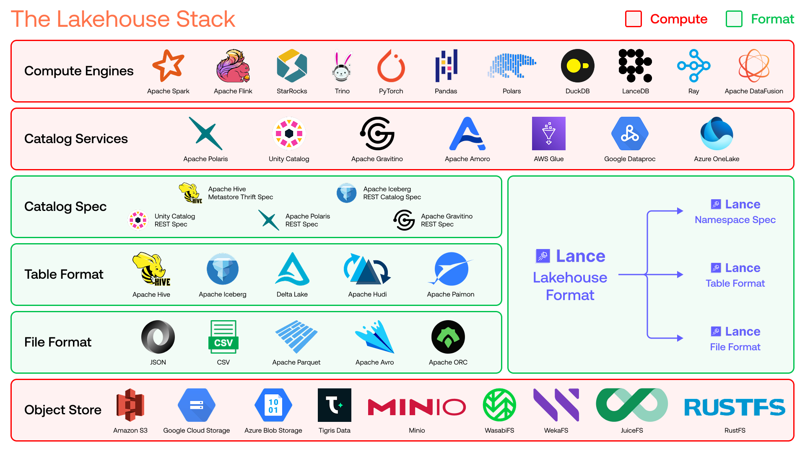
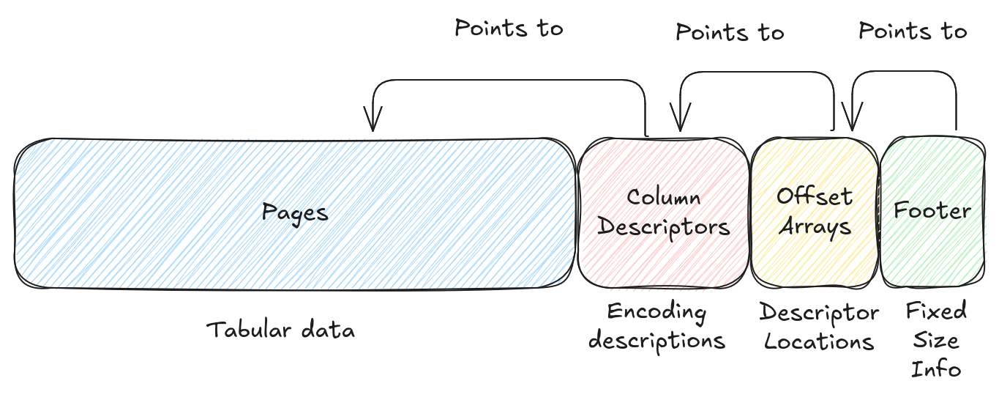
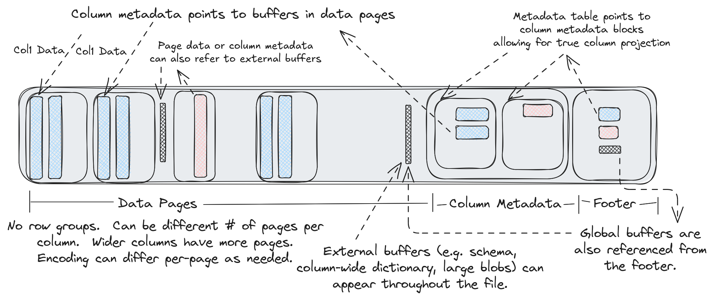

# LakeHouse



上面这是一个典型的湖仓架构，以及在每层架构中对应的技术栈，从低至上：

- Ojbect Store - 对象存储

  文件对象存储能力,典型的有S3,GCS等

- File Format - 文件格式

  定义一个简单文件以怎样的格式存储在磁盘当中

- Table Format - 表格式

  定义多个文件如何组成一个逻辑上的表

- Catalog Spec - 元数据规范

  定义系统怎么去发现和管理这些表的集合

- Catalog Service - 元数据服务

  定义一套或多套Catalog规范,提供统一元数据管理,数据治理等能力,这里面各个厂商有自己操作空间

- Compute Engines - 计算引擎

  执行数据工作流,包括查询,分析,向量检索,全文搜索等

# Lance-Format

Lance is an open lakehouse format for multimodal AI. It contains a **file format**, **table format**, and **catalog spec** that allows you to build a complete lakehouse on top of object storage to power your AI workflows. 

## Lance File Format

https://lance.org/format/file/



- Columns列数据都存在Pages(默认大小8MB)当中,不同的列由于其大小不一样,对应page数量也不一样,文件末尾的元数据定义了page的位置和数据编码方式.
- 对比Parquet格式,Lance Format没有"Row Group"的概念,只有Page.
- 每个Page都有一个绝对偏移量的引用,因此在Page之间可以插入非Page数据.
- 文件尾描述每个Page的元信息及其编码策略,这些元信息共同组成一系列"Column Descriptors"(其中说明每个列独立的Protobuf信息,即序列化信息).
- Offset Arrays描述了Column Descriptors和global buffer的偏移量.
- 固定大小的Footer描述了Offset Arrays的位置和元数据部分的开始.
- 所有列都会被"Column Index"引用,全局缓冲区也会被"Global Buffer Index"因此,且schema信息也是存在全局缓冲区中,其实就是external buffer的区域

实际读取数据是**从尾部元数据开始读**,解析Footer读取元数据,实际读取的时候也不是把所有列的数据都读上来,而是单个列的去读;实际读取数据是扫描某一列的页面,确定需要哪些页面,并且每个页面中都存储该页面中第一行的偏移量元数据,这样能快速确定需要的字节范围.



```text
// Note: the number of buffers (BN) is independent of the number of columns (CN)
//       and pages.
//
//       Buffers often need to be aligned.  64-byte alignment is common when
//       working with SIMD operations.  4096-byte alignment is common when
//       working with direct I/O.  In order to ensure these buffers are aligned
//       writers may need to insert padding before the buffers.
//
//       If direct I/O is required then most (but not all) fields described
//       below must be sector aligned.  We have marked these fields with an
//       asterisk for clarity.  Readers should assume there will be optional
//       padding inserted before these fields.
//
//       All footer fields are unsigned integers written with little endian
//       byte order.
//
// ├──────────────────────────────────┤
// | Data Pages                       |
// |   Data Buffer 0*                 |
// |   ...                            |
// |   Data Buffer BN*                |
// ├──────────────────────────────────┤
// | Column Metadatas                 |
// | |A| Column 0 Metadata*           |
// |     Column 1 Metadata*           |
// |     ...                          |
// |     Column CN Metadata*          |
// ├──────────────────────────────────┤
// | Column Metadata Offset Table     |
// | |B| Column 0 Metadata Position*  |
// |     Column 0 Metadata Size       |
// |     ...                          |
// |     Column CN Metadata Position  |
// |     Column CN Metadata Size      |
// ├──────────────────────────────────┤
// | Global Buffers Offset Table      |
// | |C| Global Buffer 0 Position*    |
// |     Global Buffer 0 Size         |
// |     ...                          |
// |     Global Buffer GN Position    |
// |     Global Buffer GN Size        |
// ├──────────────────────────────────┤
// | Footer                           |
// | A u64: Offset to column meta 0   |
// | B u64: Offset to CMO table       |
// | C u64: Offset to GBO table       |
// |   u32: Number of global bufs     |
// |   u32: Number of columns         |
// |   u16: Major version             |
// |   u16: Minor version             |
// |   "LANC"                         |
// ├──────────────────────────────────┤
//
// File Layout-End
```

Column Metadatas 

```text
message ColumnMetadata {

  // 描述page中列元信息
  message Page {
    // 页面缓冲区的文件偏移量
    repeated uint64 buffer_offsets = 1;
    // 页面缓冲区大小
    repeated uint64 buffer_sizes = 2;
    // 页面长度,例如有多少行
    uint64 length = 3;
    // 编码方式
    Encoding encoding = 4;
    // 页面优先级
    //
    // For tabular data this will be the top-level row number of the first row
    // in the page (and top-level rows should not split across pages).
    uint64 priority = 5;
  }
  // 列编码信息,描述如何去解析列元信息,例如描述统计数据或字典信息如何在列元数据中存储的
  Encoding encoding = 1;
  // 列的page数量
  repeated Page pages = 2;
  // 列元信息缓冲区的文件偏移量
  repeated uint64 buffer_offsets = 3;
  // 列元信息缓冲区大小
  repeated uint64 buffer_sizes = 4;

}
```


## Lance Table Format


## Lance Catalog Spec


# LancdDB

## Vector Index